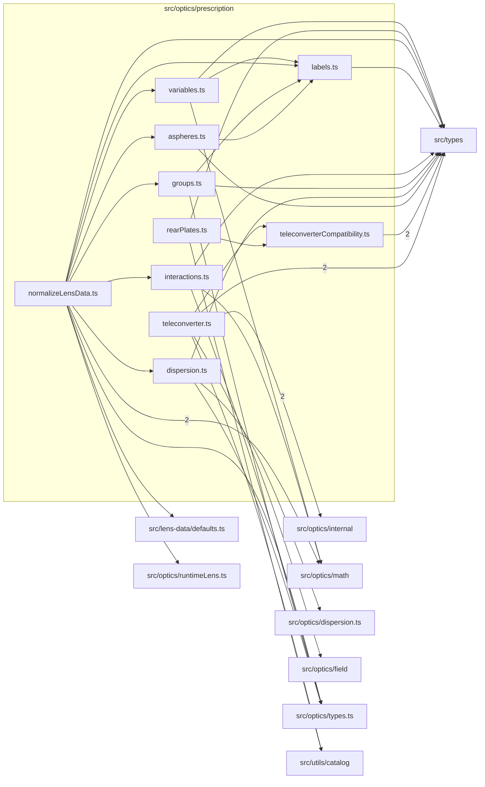

# src/optics/prescription

This folder lens prescription normalization, variable gaps, labels, groups, dispersion, interactions, and aspheric helpers.

Generated `readme.md` and `improvementsuggestions.md` files are intentionally omitted from the per-file inventory so this document stays focused on source relationships.

## Relationship Diagram

## Directory Overview

- Direct source files: 10
- Direct subfolders: 0
- Main outbound areas: src/types (12), same folder (11), src/optics/math (4), src/optics/types.ts (4), src/optics/internal (2), src/utils/catalog (2), src/lens-data/defaults.ts, src/optics/dispersion.ts, +2 more
- External consumers: src/optics/chromatic, src/optics/compat.ts, src/optics/diagram, src/optics/field, src/optics/first-order, src/optics/internal, src/optics/runtimeLens.ts, src/optics/state, +4 more

## Files

| File | Role | Imports from | Imported by | Exports |
| --- | --- | --- | --- | --- |
| `aspheres.ts` | Aspheres helper module | same folder, src/types | same folder | compileAspheres |
| `dispersion.ts` | Dispersion helper module | src/optics/dispersion.ts, src/optics/types.ts, src/types | same folder, src/optics/chromatic | compileSurfaceDispersions |
| `groups.ts` | Groups helper module | same folder, src/optics/types.ts, src/types | same folder | compileElements, compileAnnotations |
| `interactions.ts` | Interactions helper module | src/optics/math, src/optics/types.ts, src/types | same folder | yzNormalToVec3, compileSurfaceInteraction, resolvedImagePlaneToPlane3, imagePlaneDataToPlane3 |
| `labels.ts` | Labels helper module | src/types | same folder (4) | Optics2LensNormalizationError, buildSurfaceLabelMap, resolveLabel |
| `normalizeLensData.ts` | Normalize Lens Data helper module | same folder (6), src/optics/math (2), src/lens-data/defaults.ts, src/optics/runtimeLens.ts, src/optics/types.ts, +1 more | src/optics/chromatic (2), src/optics/first-order (2), src/optics/compat.ts, src/optics/diagram, src/optics/field, +1 more | withLensDefaults, normalizeLensData, normalizeRuntimeLens |
| `rearPlates.ts` | Rear Plates helper module | same folder, src/types, src/utils/catalog | src/optics/runtimeLens.ts, src/optics/validateLensData.ts | REAR_PLATE_LABEL_PATTERN, rearPlateSurfaceLabels, rearPlateAirEquivalentMm, expandRearPlates, lastLensSurfaceIndex |
| `teleconverter.ts` | Teleconverter helper module | src/optics/internal (2), src/types (2), same folder, src/optics/field, src/utils/catalog | src/optics/teleconverter.ts, src/optics/validateTeleconverterData.ts | TeleconverterAttachError, teleconverterSurfaceLabel, teleconverterGroupLabel, mergeTeleconverterPrescription, attachTeleconverter |
| `teleconverterCompatibility.ts` | Teleconverter Compatibility helper module | src/types (2) | same folder (2), src/optics/teleconverter.ts, src/optics/validateLensData.ts, src/optics/validateTeleconverterData.ts | TELECONVERTER_LABEL_PREFIX, MIN_TELECONVERTER_GAP_MM, TeleconverterHost, rearPlateAirEquivalentMm, teleconverterGeometry, teleconverterCompatibility |
| `variables.ts` | Variables helper module | same folder, src/optics/math, src/types | same folder, src/optics/internal, src/optics/state | DEFAULT_FOCUS_POSITIONS, compileVariableGaps, compileVariableLabels, resolveVariableThickness, resolveAberrationThickness, resolveControlledThickness |
